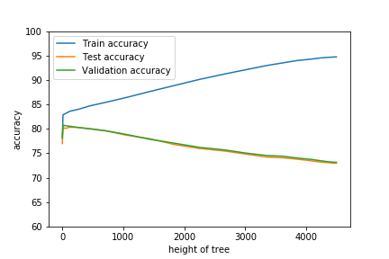

# Prediction of Credit Card Fraud detection : SVM & DECISION TREE

### Project Overview:

Application of machine learning in financial sectors is commonly seen practice, In this project we will try to explore the possiblity of applying Machine learning in credit card fraud detection, the dataset is taken from UCI repository, and depending on the various socio-economic criteria we will find the possibility of credit card fraud of an individual,

A decision tree is built on an entire dataset, using all the features/variables of interest, whereas a random forest randomly selects observations/rows and specific features/variables to build multiple decision trees from and then averages the results.A decision tree is built on an entire dataset, using all the features/variables of interest, whereas a random forest randomly selects observations/rows and specific features/variables to build multiple decision trees from and then averages the results.

### Prerequisites:

  - Python (3.3 Or later)
  - Jupyter notebook
  - Matplotlib
  - pickle
  - numpy
  - scipy
  - libsvm

For all the above prerequisite except of the networkx package can be installed all at once using the [Anaconda Package](https://www.anaconda.com/)

### How to run the code:

1. Install all the prerequisites that are mentioned above which is required to run the code
2. Open Jupyter notebook and open the notebook **Creditcard.ipynb**
3. Modify the input files as required
### Some results:

### Contact us:
If you have problems, questions, ideas or suggestions, please contact us by posting to this mailing list-

* Deeksha Chouksey- deekshachouksey888@gmail.com
* Anjali Agrawal- anjaliagrawal.anj@gmail.com

